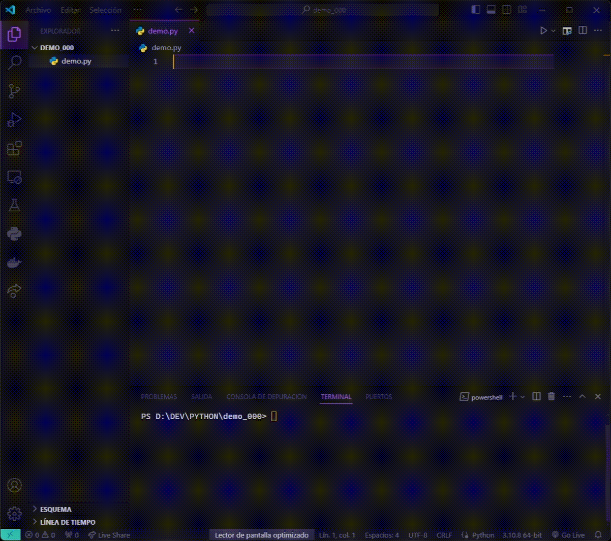

# Pycurlybraces VS Code Extension

In short, Pycurlybraces is an extension that allows to simulate in some way the use of curly braces(“{}”) in Python. Its purpose is to be used with: if, elif, else, while, for, def, class, try, catch, finally and with. Keep in mind that nothing has changed in Python, so you must continue to respect its syntax and indentation rules.

## Features
---
This extension searches for the patterns: `#{`,`:#{`,`#}`, then hides them and puts the character corresponding to each pattern on them.

- The patterns `#{` and `:#{` VSCode will display them as `{` 
- The pattern `#}` VSCode will display it as `}` 
- You can see or not the "real text" when the cursor is over `{` and `}` (commands: enableOnCursorOver, disableOnCursorOver).
- Snippets to autocomplete: if, elif, else, while, for, def, class, try, catch, finally, match, case and withy, to avoid making mistakes.
- Built-in behaviors that allow autocompletion of the opening of: if, elif, else, while, for, def, class, try, catch, finally, match, case and with when the `{` key is pressed (commands: enableBehaviors, disableBehaviors).
- Escape characters: `\#{`, `\#}`

The mentioned features can be disabled individually if you do not want to use them. Disabling some features may help improve performance.

Recommendation: Please DO NOT use the patterns: `#{`,`:#{` and `#}` in strings and comments, and DO NOT write anything after them
## Installation
---
1. Launch Visual Studio Code
2. Go to Extensions
3. Search for "Pycurlybraces"
4. Click Install

---
Pasto, Colombia. July 27, 2024. by Brayan Ceron. 

Pdt: I am a less than trainee developer, so it is quite possible that the code quality is poor.